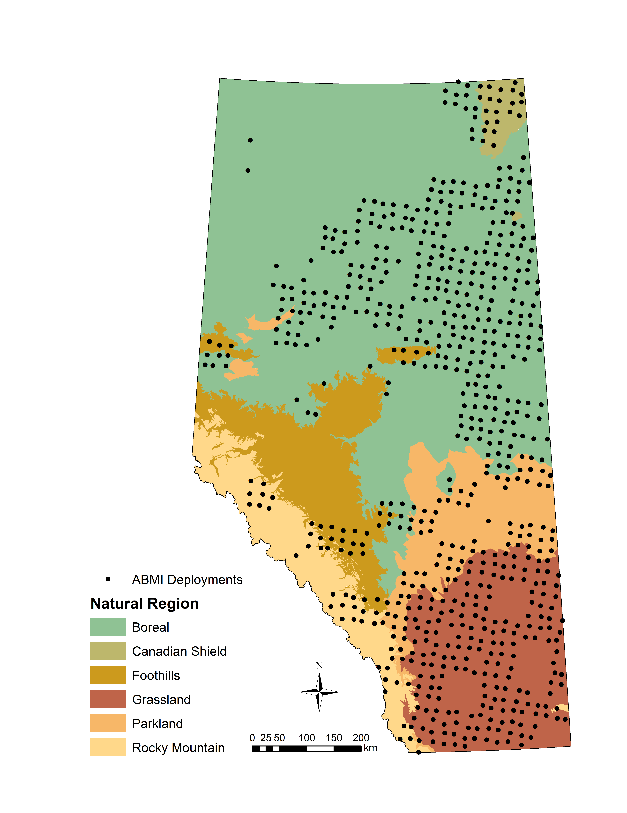

---
output:
  github_document:
    html_preview: false
---

```{r setup, include=TRUE, echo=FALSE}

library(knitr)
# Set knitr chunk options
opts_chunk$set(include=TRUE, echo=TRUE, message=FALSE, warning=FALSE, eval=TRUE)

```

# abmi.camera.extras

> Functions for using ABMI camera data to estimate animal density

<!-- badges: start -->
[](https://travis-ci.org/mabecker89/abmi.camera.extras)
<!-- badges: end -->

**Warning: under development!**

## Overview

This package provides access to the Alberta Biodiversity Monitoring Institute's (ABMI) camera-level animal density estimates, which can be used to estimate the density (and associated confidence bounds) of various species in a user-defined area of interest. For more information on how the ABMI estimates animal density from camera data, visit this [repository](https://github.com/ABbiodiversity/mammals-camera) for a detailed explanation and code base.

This package currently contains ABMI camera data from:

+ 2015
+ 2016
+ 2017
+ 2018
+ 2019 (*coming soon!*)

And includes the following species:

+ White-tailed Deer
+ Mule deer
+ Moose
+ Elk (wapiti)
+ Black Bear
+ Coyote
+ Pronghorn
+ Snowshoe Hare
+ Woodland Caribou
+ Canada Lynx
+ Gray Wolf

Current geographic coverage of sampling in the province can be seen in the map below:

```{r echo=FALSE, fig.align="center", fig.height=6}



```

## Installation

```{r}

# Install the latest version from Github:
# install.packages("devtools")

# devtools::install_github("mabecker89/abmi.camera.extras")

```

## Features

The primary objective of this package is to allow users to estimate the density of a species of interest in an area of interest. For this objective, three steps are neccessary:

+ Spatially subset ABMI camera deployments by a user-supplied area of interest (or multiple);
+ Join pre-processed individual deployment density estimates to the this spatial subset;
+ Summarise density for the area of interest as a whole, including confidence bounds.

## Usage

```{r}

# Load package
library(abmi.camera.extras)

# Load packages for working with spatial data
library(sf)
# Note: sp objects will also work.
# library(sp)

```

The first step is to define an area of interest, such as a Wildlife Management Unit, Municipality, Land Use Planning Region, etc. Below, this is done using the `sf` package to read in a shapefile of four WMUs - Crow Lake (code 512), Lac La Biche (503), Beaver River (502), and Amisk (504) - all of which are located in the central-east part of Alberta. 

```{r}

# Define aoi
sf_wmu <- sf::st_read(system.file("extdata/wmu_sample.shp", package = "abmi.camera.extras"), quiet = TRUE)

# Take a look at structure and attributes
tibble::glimpse(sf_wmu)

```

Next, we subset ABMI camera deployments spatially with the `get_cam()` function:

```{r warning=FALSE}

# Retrieve deployments in aoi as dataframe
df_deployments <- get_cam(aoi = sf_wmu,
                          cols = "WMUNIT_NAM", # Maintain WMU name attribute in output
                          keep.all = FALSE)

# Plot deployments
sf_wmu <- st_transform(sf_wmu, "+init=epsg:4326")
plot(df_deployments$geometry, pch = 21, cex = 0.7, col = "blue", bg = "gray80")
plot(sf_wmu$geometry, border = "gray20", col = NA, add = TRUE)

```

Note that there are four cameras deployed at each ABMI site, 600-m apart. Each point on the plot represents a site, which has four deployments. See [here](https://www.abmi.ca/home/publications/551-600/565) for detailed explanation of remote camera trap protocols. 

From here we can join density estimates for a species of interest in a given year for each deployment using the `join_dens()` function:

```{r warning=FALSE}

# Join density
df_dens <- join_dens(x = df_deployments,
                     species = c("Moose", "Mule deer"), # See ?join_dens for list of available species
                     # year = "2018" option to define specific year if desired
                     nest = FALSE)

```

The last step is to estimate the density of each of the species defined previously in the area of the interest, which can be done with the `summarise_dens()` function.

The output is a dataframe with the following attributes (beside the grouping variable, year, and species):

+ `occupied` - number of deployments with a individual of that species present
+ `n_deployments` - total number of deployments
+ `occupancy` - proportion of deployments occupied (not detection probability adjusted)
+ `density_avg` - estimated density for the area/year/species combination
+ `density_lci` - lower bounds of confidence interval (level specified in `conflevel` attribute)
+ `density_uci` - upper bounds of confidence interval

The precision of the density estimate is estimated using the [delta method](https://en.wikipedia.org/wiki/Delta_method).

```{r}

# Summarise density
df_dens_summary <- summarise_dens(x = df_dens,
                                  group = WMUNIT_NAM, # to group deployments when evaluating multiple aoi
                                  agg.years = FALSE, # option to aggregate years together
                                  conflevel = 0.9) # for confidence interval - default 90%

```

Note that this family of three functions is designed to work with a [pipeline-based workflow](https://r4ds.had.co.nz/pipes.html), and can be re-written in the following way:

```{r}

df_dens_summary <- sf_wmu %>%
  get_cam(cols = "WMUNIT_NAM", keep.all = FALSE) %>%
  join_dens(species = c("Moose", "Mule deer")) %>%
  summarise_dens(group = WMUNIT_NAM, agg.years = FALSE, conflevel = 0.9)

knitr::kable(head(df_dens_summary, n = 10))

```


