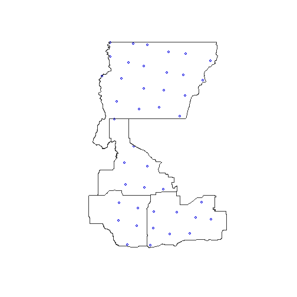
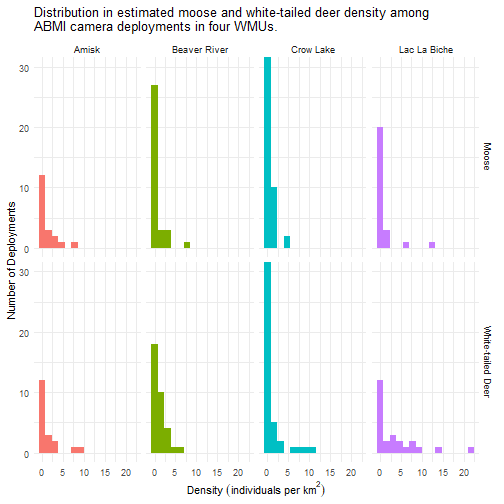

---
output:
  github_document:
    html_preview: false
---


# abmi.camera.extras

> Functions for using ABMI camera data to estimate animal density in an area of interest

<!-- badges: start -->
[](https://travis-ci.org/mabecker89/abmi.camera.extras)
<!-- badges: end -->

**Warning: under development!**

## Installation


```r
# Install the latest version from Github:
# install.packages("remotes")
remotes::install_github("mabecker89/abmi.camera.extras")
```

## Overview

This package provides access to the Alberta Biodiversity Monitoring Institute's (ABMI) camera-level animal density estimates, which can be used to estimate the density (and associated confidence bounds) of various species in a user-defined area of interest. For more information on how the ABMI estimates animal density from camera data, please review this [report](https://www.abmi.ca/home/publications/501-550/516) and visit this [repository](https://github.com/ABbiodiversity/mammals-camera) for associated code base.

This package currently contains data from ABMI camera deployments in the following years:


This data includes density information on the following species:

+ White-tailed Deer
+ Mule deer
+ Moose
+ Elk (wapiti)
+ Black Bear
+ Coyote
+ Pronghorn
+ Snowshoe Hare
+ Woodland Caribou
+ Canada Lynx
+ Gray Wolf

Current (as of 2018) geographic coverage of sampling in the province can be seen in the map below:


## Features

The primary objective of this package is to allow users to estimate the density of a species of interest in an area of interest. For this objective, three steps are neccessary:

1. Spatially subset ABMI camera deployments by a user-supplied area of interest (or multiple);
1. Join pre-processed individual deployment density estimates to this spatial subset of cameras;
1. Summarise density for the area of interest as a whole, including confidence bounds.

## Usage and Recommended Workflow


```r
# Load package
library(abmi.camera.extras)

# Load packages for working with spatial data and plotting results
library(sf)
# Note: sp objects will also work.
# library(sp)
library(ggplot2)
```

The first step is to define an area of interest, such as a Wildlife Management Unit, Municipality, Land Use Planning Region, etc. Below, this is done using the `sf` package to read into R a shapefile of four WMUs - Crow Lake (code 512), Lac La Biche (503), Beaver River (502), and Amisk (504) - all of which are located in the central-east part of Alberta. 


```r
# Define aoi
sf_wmu <- sf::st_read(system.file("extdata/wmu_sample.shp", package = "abmi.camera.extras"), quiet = TRUE)

# Take a look at structure and attributes
tibble::glimpse(sf_wmu)
```

```
## Rows: 4
## Columns: 6
## $ OBJECTID   <dbl> 25, 34, 49, 50
## $ WMUNIT_NAM <fct> Crow Lake, Lac La Biche, Beaver River, Amisk
## $ WMUNIT_COD <fct> 00512, 00503, 00502, 00504
## $ Shape_STAr <dbl> 8018929846, 3220514507, 3585827617, 2704241428
## $ Shape_STLe <dbl> 476404.3, 355774.1, 293530.4, 252285.2
## $ geometry   <POLYGON [m]> POLYGON ((754560.7 6209247,..., POLYGON ((713202.4 6072527,..., POLYGON ((726590.5 6050538,..., POLYGON ((658601.6 6054492,...
```

Next, we subset ABMI camera deployments spatially with the `ace_get_cam()` function:


```r
# Retrieve deployments in aoi as dataframe
df_deployments <- ace_get_cam(aoi = sf_wmu,
                              id = WMUNIT_NAM, # Use `id` to define identifier (e.g. WMU name)
                              crs = 4326) # If desired, (re)project using the `crs` argument

# Plot deployments
sf_wmu <- st_transform(sf_wmu, "+init=epsg:4326")
plot(df_deployments$geometry, pch = 21, cex = 0.7, col = "blue", bg = "gray80")
plot(sf_wmu$geometry, border = "gray20", col = NA, add = TRUE)
```



Note that there are four cameras deployed at each ABMI site, 600-m apart. Each point on the plot represents a site, which has four deployments. See [here](https://www.abmi.ca/home/publications/551-600/565) for detailed explanation of remote camera trap protocols. 

From here we can join density estimates for a species of interest in a given year for each deployment using the `ace_join_dens()` function:


```r
# Join density
df_dens <- ace_join_dens(x = df_deployments,
                         species = c("Moose", "White-tailed Deer"), # See ?ace_join_dens for list of available species
                         # year = "2018", option to define specific year if desired
                         nest = FALSE)
```

The distribution is typically right-skewed, with most cameras not detecting any individuals (0 density), some who detect a small number of individuals just passing by (low density), and a few who capture longer periods of animal activity (high density).



The last step is to estimate the density of each of the species defined previously in the area of the interest, which can be done with the `ace_summarise_dens()` function.


```r
# Summarise density
df_dens_summary <- ace_summarise_dens(x = df_dens,
                                      id = WMUNIT_NAM, # to group deployments when evaluating multiple aoi
                                      agg.years = FALSE, # option to aggregate years together
                                      conflevel = 0.9) # for confidence interval - default 90%
```

The output is a dataframe with the following attributes (beside the grouping variable, year, and species):

+ `occupied` - number of deployments with a individual of that species present
+ `n_deployments` - total number of deployments
+ `prop_occupied` - proportion of deployments occupied
+ `density_avg` - estimated density for the area/year/species combination
+ `density_lci` - lower bounds of confidence interval (level specified in `conflevel` attribute)
+ `density_uci` - upper bounds of confidence interval

The precision of the density estimate is estimated using the [delta method](https://en.wikipedia.org/wiki/Delta_method). Note that some ABMI camera deployments are set up with a lure; the subsequent density estimates have been adjusted to facilitate comparison with non-lured estimates when summarising animal density for an aoi. 

Note that this family of three functions is designed to work with a [pipeline-based workflow](https://r4ds.had.co.nz/pipes.html), and can be re-written in the following way:


```r
df_dens_summary <- sf_wmu %>%
  ace_get_cam(id = WMUNIT_NAM) %>%
  ace_join_dens(species = c("Moose", "White-tailed Deer")) %>%
  ace_summarise_dens(id = WMUNIT_NAM, agg.years = FALSE, conflevel = 0.9)

knitr::kable(head(df_dens_summary, n = 10))
```


|WMUNIT_NAM   | Year|common_name       | occupied| n_deployments| prop_occupied| density_avg| density_lci_0.9| density_uci_0.9|
|:------------|----:|:-----------------|--------:|-------------:|-------------:|-----------:|---------------:|---------------:|
|Amisk        | 2014|Moose             |        4|             4|     1.0000000|   4.0651097|       3.0820413|       5.2376116|
|Amisk        | 2014|White-tailed Deer |        4|             4|     1.0000000|   0.2804053|       0.1897704|       0.3946967|
|Amisk        | 2018|Moose             |        6|            15|     0.4000000|   0.5113879|       0.2372165|       0.8224746|
|Amisk        | 2018|White-tailed Deer |       11|            15|     0.7333333|   1.8739315|       1.2926935|       2.4890272|
|Beaver River | 2016|Moose             |        6|            21|     0.2857143|   0.1682201|       0.0714797|       0.2826980|
|Beaver River | 2016|White-tailed Deer |       17|            21|     0.8095238|   1.1625098|       0.9327284|       1.3835823|
|Beaver River | 2017|Moose             |        4|             4|     1.0000000|   0.9331167|       0.5482670|       1.4530801|
|Beaver River | 2017|White-tailed Deer |        4|             4|     1.0000000|   1.4475633|       1.3318144|       1.5691199|
|Beaver River | 2018|Moose             |        6|             9|     0.6666667|   1.5955008|       0.8493681|       2.4650502|
|Beaver River | 2018|White-tailed Deer |        6|             9|     0.6666667|   1.2479091|       0.6652393|       1.9519171|

## License 

The estimates, predictions, and related documentation are © ABMI (2013-2018) under a [CC BY-SA 4.0 license](https://creativecommons.org/licenses/by-sa/4.0/).

This R package is licensed under [MIT license](https://github.com/mabecker89/abmi.camera.extras/blob/master/LICENSE) © 2020 Marcus Becker, David Huggard, and the ABMI.

## Issues

To report bugs, request additional features, or get help using the package, please file an [issue](https://github.com/mabecker89/abmi.camera.extras/issues). You can also email Marcus Becker mabecker@ualberta.ca. 


